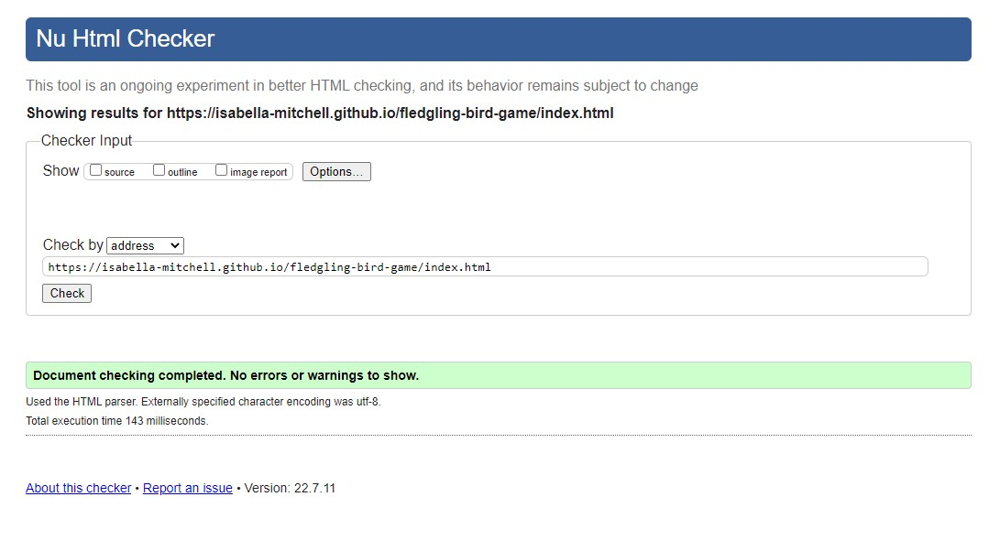
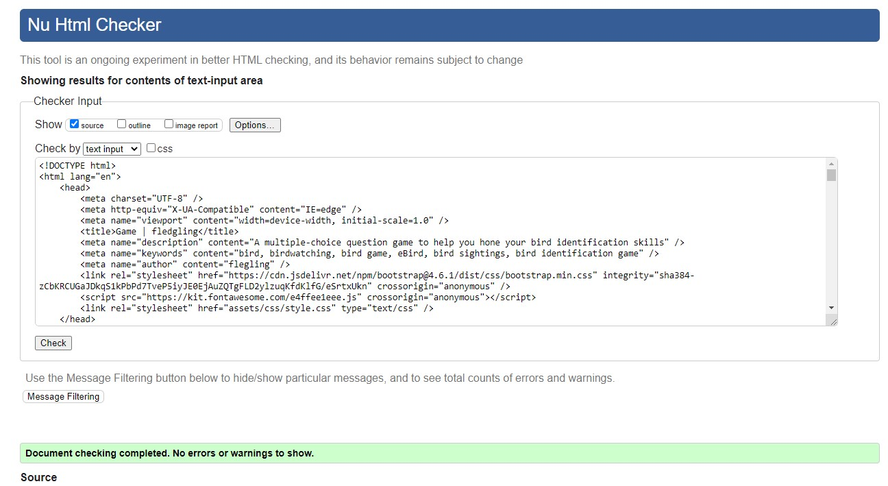
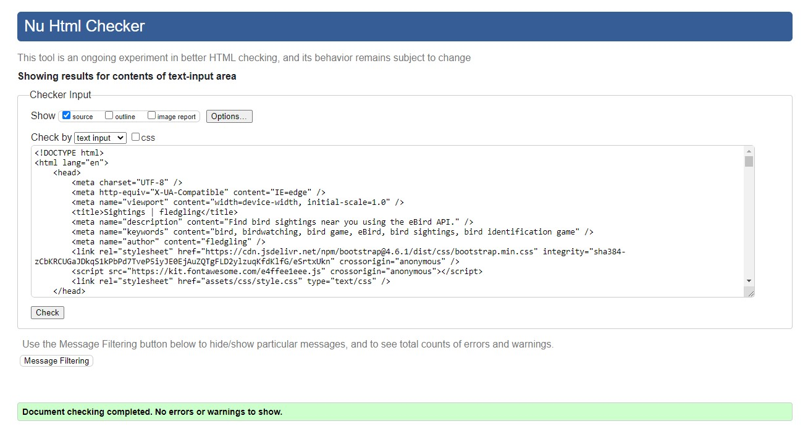
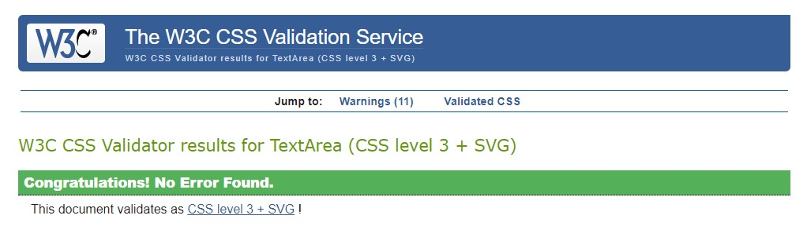
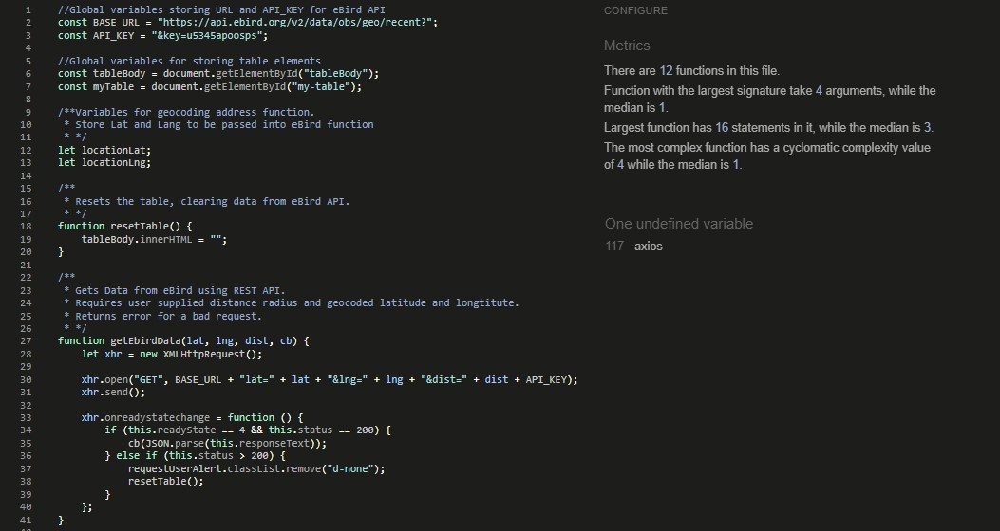
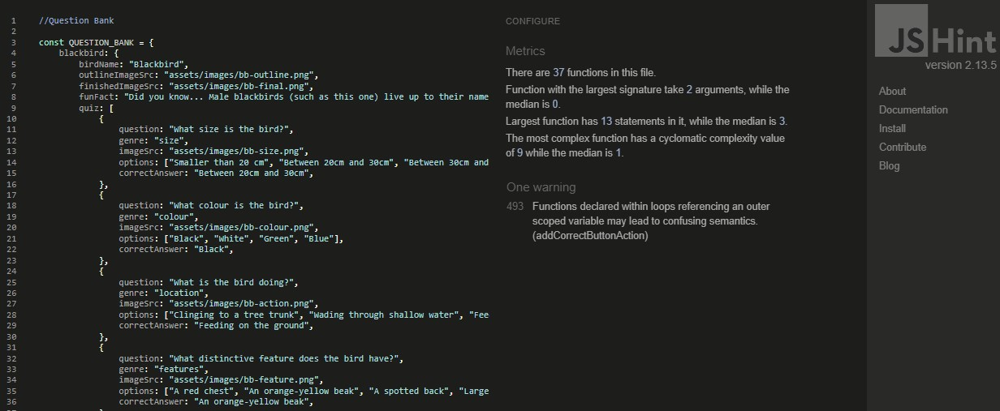
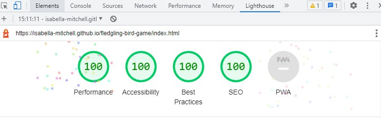
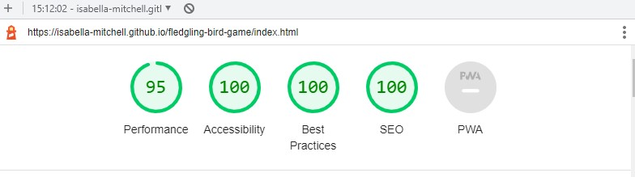

# Testing

The Row Gallery website has been tested using the following methods:
- [Code Validation](#code-validation)
    - [W3C HTML Validator](#w3c-html-validator) 
    - [W3C CSS Validator](#w3c-css-validator)
    - [JSHINT Javascript Code Quality Tool](#jshint-javascript-code-quality-tool)
- [Lighthouse](#lighthouse)
- [Responsiveness](#responsiveness)
- [A11y Color Contrast Accessibility Checker](#a11y-color-contrast-accessibility-checker)
- [Browser Compatibility](#browser-compatibility)
- [Testing User Stories](#testing-user-stories)
        - [Novice Bird Watcher](#novice-bird-watcher)
        - [Intermediate/ Advanced Bird Watcher](#intermediate-advanced-bird-watcher)
        - [Game User](#game-user)
        - [Business Owner](#business-owner)
- [Manual Testing](#manual-testing)
        - [Landing Page](#landing-page)
        - [Game Page](#game-page)
        - [Sightings Page](#sightings-page)
- [Peer Review](#peer-review)
- [Bugs](#bugs)
    - [Resolved](#resolved)
    - [Unresolved](#unresolved)

# Code Validation

## W3C HTML Validator

The Fledgling website passed all tests using the [W3C HTML](https://validator.w3.org/) Validator tool

### Landing Page
<h2 align="center"></h2>

### Game Page
<h2 align="center"></h2>

### Sightings Page
<h2 align="center"></h2>

## W3C CSS Validator

The Fledgling website passed all tests using the [W3C CSS](https://jigsaw.w3.org/css-validator/) Validator tool
<h2 align="center"></h2>

## JSHINT Javascript Code Quality Tool

The Fledgling website showed some errors using the [JSHint](https://jshint.com/) Javascript validation tool. See unresolved bugs.

### eBird.js
<h2 align="center"></h2>

### script.js
<h2 align="center"></h2>

# Lighthouse

### Lighthouse Report for Landing Page (Desktop)
<h2 align="center"></h2>

### Lighthouse Report for Landing Page (Mobile)
<h2 align="center"></h2>

I used the Lighthouse reports in Google Developer Tools to examine the pages of the website for the following
- Performace
- Accessibility
- Best Practices 
- SEO

All Pages performed well (scored 95 and above) in:
- Performance, Accessibility, Best Practices and SEO on Desktop
- Accessibility, Best Practices and SEO on Mobile

In some tests the game page did not perform as well (scored 79 and above) in:
- Performance on mobile

Lighthouse recommends eliminating render-blocking resources to improve performance on mobile. (Detailed in [Unresolved Bugs](#unresolved) section)

# A11y Color Contrast Accessibility Checker

All website pages were tested using the A11y Color Contrast Accessibility Checker and no automated colour contrast issues were found.

<h2 align="center"></h2>

<h2 align="center"></h2>

<h2 align="center"></h2>

# Browser Compatibility

The site was tested in Google Chrome, Microsoft Edge and Mozilla Firefox on desktop.

The site was tested in Google Chrome and Safari on mobile and tablet.

No issues arose during browser testing. CSS transitions worked on all browsers tested. 

Appearance, functionality and responsiveness were largely consistent across browsers and devices. The only exception involved images stretching on iPad, which is an issue I've experienced before using Flex. (See [Resolved Bugs](#resolved))

# Responsiveness

Responsivity tests were carried out using Google Chrome DevTools. Device screen sizes covered include:
- iPhone SE
- iPhone XR
- iPhone 12 Pro
- Pixel 5
- Samsung Galaxy S8+
- Samsung Galaxy S20 Ultra
- iPad Mini
- iPad Air
- Surface Pro 7
- Surface Duo
- Galaxy Fold
- Samsung Galaxy A51/71
- Nest Hub
- Nest Hub Max

I also personally tested the website on iPhone 12, iPhone 11, iPad Pro 2nd Generation, Dell XPS 15 laptop and a Dell widescreen monitor.

# Testing User Stories

## Novice Bird Watcher

- As a novice bird watcher, I would like to play a bird identification game so to learn about bird-watching in an engaging way.
    - On the landing page there is a button the user can click to ‘Play the Game’
    - This takes the user to the game screen. They can choose to ‘Start the Game’ and learn ‘How To Play’
    - The game involves multiple-choice questions about images of birds pictured. The player must identify which answer best describes the bird’s features.
    - The same type of questions are asked in the same order, similar to how you would identify these birds in real life.
    - The game makes the user engage by requiring them to interact with buttons and presenting them with options to choose from.

- As a novice bird watcher, I would like to be inspired by pleasing visuals and fun facts about birds.

    - On the landing page, there is a GIF which reflects the content of the gameplay.
    - In the game, there are 5 birds to identify. Throughout the gameplay, different images appear to highlight different features of the birds.
    - The illustrations are consistent in style and size, to keep the website looking visually clean and pleasing.
    - The illustrations are responsive and can be viewed on any device size.
    - Illustrations fade in and out through the use of CSS animations, to make the changing images appear visually pleasing and so they do not jolt.

- As a novice bird watcher, I would like to see whether there have been any bird sightings near me recently.

    - On the landing page, there is a button ‘Find Sightings Near You’ that takes user to the sightings page.
    - This button also appears at the end of the game, so that users who finish the game can find sightings near them.
    - There is an input box labelled ‘Enter An Address, so users can put in their address, or any address they choose, and select a distance radius.
    - They click submit, and sightings near them are displayed in a table format.
    - If there is an error, an error message appears.

- As a novice bird watcher, I would like to see the location where these birds have been sighted, so that I can learn of places where I could go bird spotting.

    - Within the bird sightings table, there is a location observed column. This provides the name of the location where the bird was spotted, e.g. a street or a park.
    - This provides the user with an idea of popular bird-watching locations near their entered address.

- As a novice bird watcher, I would like all the terms used to be common knowledge and not specialist.

    - No specialist terms were used. I conducted a peer review to verify this.

## Intermediate/ Advanced Bird Watcher

- As an intermediate/ advanced bird watcher, I would like to be engaged in the content.

    - On the landing page there is a button the user can click to ‘Play the Game’
    - This takes the user to the game screen. They can choose to ‘Start the Game’ and learn ‘How To Play’
    - The birds initially appear as outlines. Even though quite well-known birds have been used in the game, it’s not initially clear what birds they are.
    - The player can still engage with the game to collect all the bird illustrations.

- As an intermediate/ advanced bird watcher, I would like to see the names of bird sightings near me, plus locations, dates and number observed.

    - On the landing page, there is a button ‘Find Sightings Near You’ that takes the user to the sightings page.
    - This button also appears at the end of the game, so that users who finish the game can find sightings near them.
    - There is an input box labelled ‘Enter An Address, so users can put in their address, or any address they choose, and select a distance radius.
    - They click submit, and sightings near them are displayed in a table format.   
    - Data provided includes Bird name, location observed, date observed and number observed.
    - If there is an error, an error message appears.

- As an intermediate/ advanced bird watcher, I would like to know where the bird-watching data is sourced from.

    - There is a credit to the data source eBird on the page title with a link to their website. This is more prominent on smaller device sizes.
    - There is also a link to ‘Learn More’ in the nav bar. This opens up a modal with further information about eBird and another link.

- As an intermediate/ advanced bird watcher who is not familiar with British birds, I would like to learn about a few common British birds.

    - On the landing page there is a button the user can click to ‘Play the Game’
    - This takes the user to the game screen. They can choose to ‘Start the Game’ and learn ‘How To Play’
    - The birds chosen for the game are common British birds. (See content credits)

## Game User

- As a game user, I would like to know my score, so I can replay and beat it.

    - The user's score is shown at the end of each round (out of 4) and at the end of the game (out of 20).
    - Feedback is also provided. The type of feedback is decided based on the user’s score.
    - If the user has a low score at the end of the game, then they are encouraged to play again.

- As a game user, I would like indication of whether I am right or wrong.
    - There are score indicator items which appear each round. There is one indicator per question.
    - If the user gets a question right, the score indicator turns green
    - If the user gets a question wrong, the score indicator turns red. 

- As a game user, I would like the game to be playable on any device.
    - The game is responsive and is playable on any device.
    - The ‘How to Play’ instructions open on a modal, so they can be accessed at any part of the game without refreshing the page. This functions on all device sizes.

## Business Owner

- As the business owner, I want my website to be accessible and user-friendly on any device.
    - The website design is responsive so remains aesthetically pleasing and functional on all screen sizes. 
    - It features semantic HTML tags, screen reader tags and aria tags for accessibility where possible. As it is a picture game, the game page is not very accessible for those with visual impairments. (See Features Left to Implement) 
    - The pages also feature meta descriptions and alt-text which is beneficial for SEO.

- As the business owner, I want to provide links to other websites where the user can learn more about bird watching and bird sightings.
    - There are links and clear credits to eBird, who provide the Bird Sighting data
    - The ‘Learn More’ modal on the sightings page also provides further bird watching resources. 

- As the business owner, I want my website to feature links to my social media channels.
    - There are links to social media channels in the footer bar, which appears on every page.

# Manual Testing

## Landing Page

- Social links in the footer have been tested and proven to work
- The main navigation buttons have been tested and proven to work

## Game Page

- The How To Play modal has been tested and proven to open and close as desired.
- The game play as been extensively tested, with all buttons and clickable elements behave as expected.
- If the user presses the select button without having selected a bird, an error message appears. The game will not continue until they have selected a bird.
- If the user presses the submit button without having selected a answer, an error message appears. The game will not continue until they have selected an answer.
- At the end of the game, the button to ‘Play Again’ and ‘Find Sightings Near Me’ have been tested and shown to work.
- The website title link back to the landing page has been tested and proven to work.
- Social links in the footer have been tested and proven to work
 
## Sightings Page

- The Learn More modal has been tested and proven to open and close as desired.
- The Address input form has been extensively tested and behaves as expected. This involves passing in incorrect data to see what errors occur.
- If there is an issue with the API, e.g. the server returns a 400 error message, then an appropriate error message appears: “Oops...Something went wrong. Please try again or contact the website administrator”
- If the user has not entered an address, then an appropriate error message appears: “That address is not recognised. Please try again with a different address.”
- If the user enters an address which is not recognised by google maps, then both these error message appear.
- If the user enters an address which is too broad for the eBird API (e.g. a Continent name), or a location with no sightings, then an appropriate error message appears: “There are no results for that address. Please try again with a different address or increase your search radius”
- The website title link back to the landing page has been tested and proven to work.
- Social links in the footer have been tested and proven to work

# Peer Review

# Bugs

## Resolved

- Ipad Image Stretch 

    - When viewing the website on iPad I noticed the images on the landing page and game page were being stretched. 
    - I have experienced before using Flex, however I couldn’t resolve this bug the same way I had before due to the whole page layout using flex. 
    - I found another solution on [Stack Overflow](https://stackoverflow.com/questions/57516373/image-stretching-in-flexbox-in-safari) which suggested this could be fixed by wrapping the image in the div. 
    - I did this and the images displayed correctly. 

- Google Maps API 

    - To Geocode my user input, I am using a Google Maps API. I set up the Google Maps API successfully by following a Youtube tutorial. However, when I tried to put HTTP restrictions on it, it stopped working. 
    - After further reading of the Google documentation, I realised that there are two Geocoding services that Google provides. You cannot put HTTP restrictions on the one I am using. I removed the restrictions and the API worked again.  
    - I have limited my API key to only work with the Google Maps Geocoding service 
    - I have set up Alerts and a budget to monitor usage of the API. 
    - If I were to further develop this project, I would change to the Google Maps JavaScript API an use this to geocode the user input, as I could put restrictions on this. (See Unresolved Bugs) 

- Bootstrap and jQuery Scripts 

    - When I first put the jQuery script into my game script, I put it above the Bootstrap scripts. It did not function properly. 
    - I reordered the scripts so that the jQuery script comes last, and it works properly. 

- Submit bird button 

    - This button functions by allowing the user to select a bird. At the start of each round, it appears disabled if no bird is selected, and appears enabled when a bird is selected. 
    - While refactoring the code, I accidently edited the function so that button would not become disabled once it was enabled. I spotted this and corrected the code so the button behaves as desired. 

- HTML game page validation 

    - When I first validated my game page HTML, the validator came back with an error. “Attribute ‘button-command' not allowed on element button at this point” 
    - I googled the issue and realised that custom attributes need to start with data.  
    - I updated the attributes to ‘data-button-command' and the code passed the validator without error.  

## Unresolved